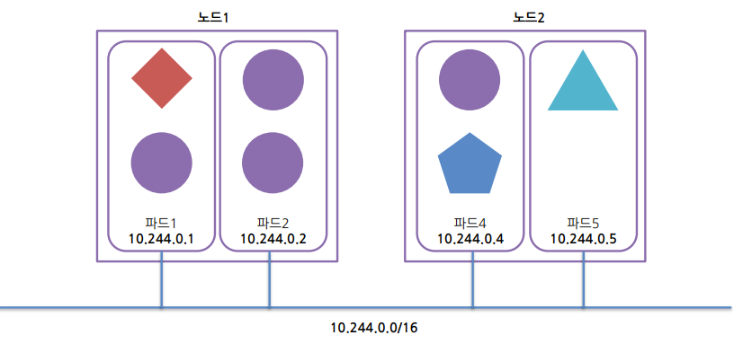

# Pod

[Document Pods](https://kubernetes.io/docs/concepts/workloads/pods/)

- 일반적으로 포드는 단일 컨테이너만 포함하지만 다수의 컨테이너를 포함 할 수 있음

플랫 인터 포드 네트워크 구조
- 쿠버네티스 클러스터의 모든 포드는 공유된 단일 플랫, 네트워크 주소 공간에 위치
- 포드 사이에는 NAT 게이트웨이가 존재하지 않음

포드 정의 구성 요소

- apiVersion: 쿠버네티스 api의 버전을 가리킴
- kind: 어떤 리소스 유형인지 결정 (파드, 레플리카 컨트롤러, 서비스 등)
- 메타데이터: 파드와 관련된 이름, 네임스페이스, 레이블 등의 정보 정의
- 스펙: 컨테이너, 볼륨 등의 정보
- 상태: 파드의 상태, 각 컨테이너의 설명 및 상태, 파드 내부의 IP 및 그 밖의 기본 정보 정의
