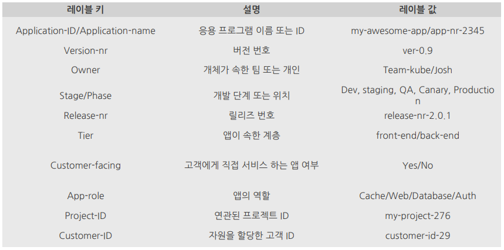

# Label

[[k8s docs] Labels and Selectors](https://kubernetes.io/docs/concepts/overview/working-with-objects/labels/)  
[[k8s docs] Well-Known Labels, Annotations and Taints](https://kubernetes.io/docs/reference/labels-annotations-taints/)
[9 Best Practices and Examples for Working with Kubernetes Labels](./9-best-practices-labels.md)  

- 모든 리소스를 구성하는 매우 간단하면서도 강력한 쿠버네티스 기능
- 리소스에 첨부하는 임의의 키/값 쌍 (예 app:test)
- 레이블 셀렉터를 사용하면 각종 리소스를 필터링하여 선택할 수 있음
- 리소스는 한 개 이상의 레이블을 가질 수 있음
- 리소스를 만드는 시점에 레이블을 첨부
- 기존 리소스에도 레이블의 값을 수정 및 추가 가능
- 모든 사람이 쉽게 이해할 수 있는 체계적인 시스템을 구축 가능
  - app: 애플리케이션 구성요소, 마이크로서비스 유형 지정
  - rel: 애플리케이션의 버전 지정 (release)

