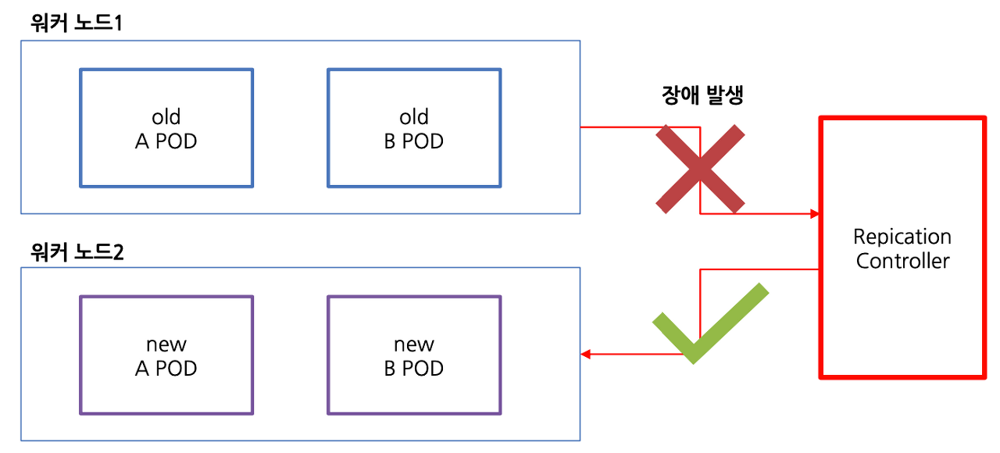

# Replication Controller and ReplicaSet

## Replication Controller

[[k8s docs] ReplicationController](https://kubernetes.io/docs/concepts/workloads/controllers/replicationcontroller/)

- ReplicaSet의 구버전에 해당함, 1.8버전 이전의 쿠버네티스에서 주로 사용
- 포드가 항상 실행되도록 유지하는 쿠버네티스 리소스
- 노드가 클러스터에서 사라지는 경우 해당 포드를 감지하고 대체 포드 생성
- 실행 중인 포드의 목록을 지속적으로 모니터링하고 '유형'의 실제 포드 수가 원하는 수와 항상 일치하는지 확인
- 이상이 있는 파드를 감지하는 기준 5분(기본 설정)
- Replication: 데이터 저장과 백업하는 방법과 관련이 있는 데이터를 호스트 컴퓨터에서 다른 컴퓨터로 복사하는 것

세가지 요소
- 레이블 셀렉터: 레플리케이션컨트롤러가 관리하는 포드 범위를 결정
  - 포드의 레이블이 변경되어 관리 밖으로 벗어나면 이를 건드리지 않고 새로운 포드를 생성
- 복제본 수: 실행해야 하는 포드의 수를 결정
- 포드 템플릿: 새로운 포드의 모양을 설명

장점
- 포드가 없는 경우 새 포드를 항상 실행
- 노드 장애 발생 시 다른 노드에 복제본 생성
- 수동, 자동으로 수평 스케일링

## ReplicaSet

[[k8s docs] ReplicaSet](https://kubernetes.io/docs/concepts/workloads/controllers/replicaset/)

- 쿠버네티스 1.8 버전부터 Deployment, DaemonSet, ReplicaSet, StatefulSet 네 API가 베타로 업데이트되고 1.9버전에서는 정식 버전으로 업데이트
- 레플리카셋은 차세대 리플리케이션컨트롤러로 rc를 완전히 대체 가능
- 일반적으로 레플리카셋을 직접 생성하지 않고 상위 수준의 디플로이먼트 리소스를 만들 때 자동으로 생성

레플리케이션 컨트롤러 vs 레플리카셋
- 레플리카셋이 더 풍부한 표현식 포드 셀렉터 사용 가능
  - rc: 특정 레이블을 포함하는 포드가 일치하는지 확인
  - rs: 특정 레이블이 없거나 해당 값과 관계없이 특정 레이블 키를 포함하는 포드를 매치하는지 확인
