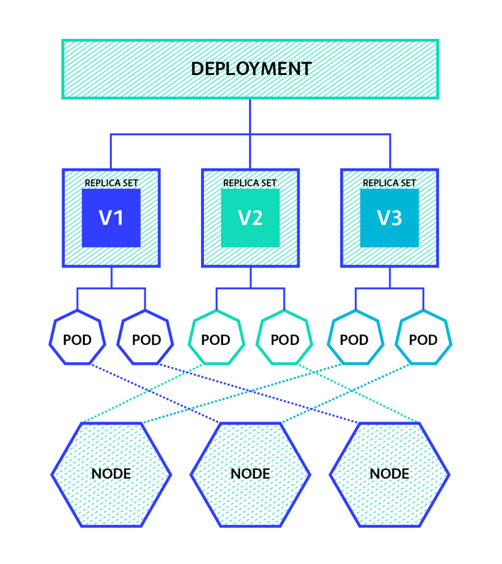

# Deployment

[[k8s docs] Deployment](https://kubernetes.io/docs/concepts/workloads/controllers/deployment/)

- 애플리케이션을 다운 타임 없이 업데이트 가능하도록 도와주는 리소스
- 레플리카셋과 레플리카컨트롤러 상위에 배포되는 리소스

## Deploy Strategy

[[k8s] Strategy](https://kubernetes.io/docs/concepts/workloads/controllers/deployment/#strategy)

- 모든 파드를 업데이트하는 방법
  - RollingUpdate:
    - 기본 설정
    - 새 버전을 배포하면서, 새 버전 파드를 하나씩 늘려가고 기존 버전의 파드를 하나씩 줄여나가는 방식
    - 무중단 배포
    - 이전 버전과 새로운 버전이 공존하는 시간이 발생하는 단점
    - maxUnavailable: 
      - 동작하지 않는 포드의 개수 설정(기본값: 25%)
      - 롤링 업데이트 중 동시에 삭제할 수 있는 파드의 최대 갯수를 의미
      - 정수: 설정한 정수 만큼 파드가 동시에 삭제될 수 있다
      - 비율: 총 파드 갯수에서 설정한 비율 만큼 삭제 될 수 있다
      - ex. 파드 4개인 경우 25%이면 1개 설정, 총 파드 갯수는 4-1=3 이상 운영해야 함
    - maxSurge: 
      - 최대로 추가 배포를 허용할 개수 설정(기본값: 25%)
      - 정수: 설정한 정수 만큼 새 버전의 파드가 추가
      - 비율: 총 파드 갯수에서 설정한 비율 만큼 추가
      - ex. 파드 4개인 경우 25%이면 1개 설정, 총 파드 갯수는 4+1=5 까지 동시 파드 운영 가능
  - Recreate:
    - 잠깐의 다운타임 발생
    - 기존 모든 포드를 삭제 후 새로운 포드 생성

## 
