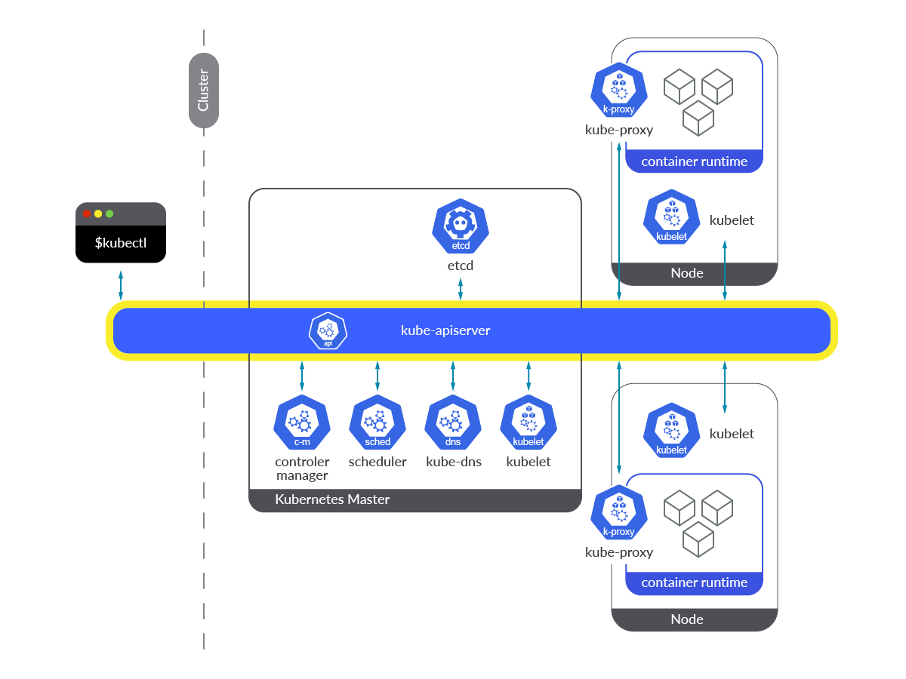
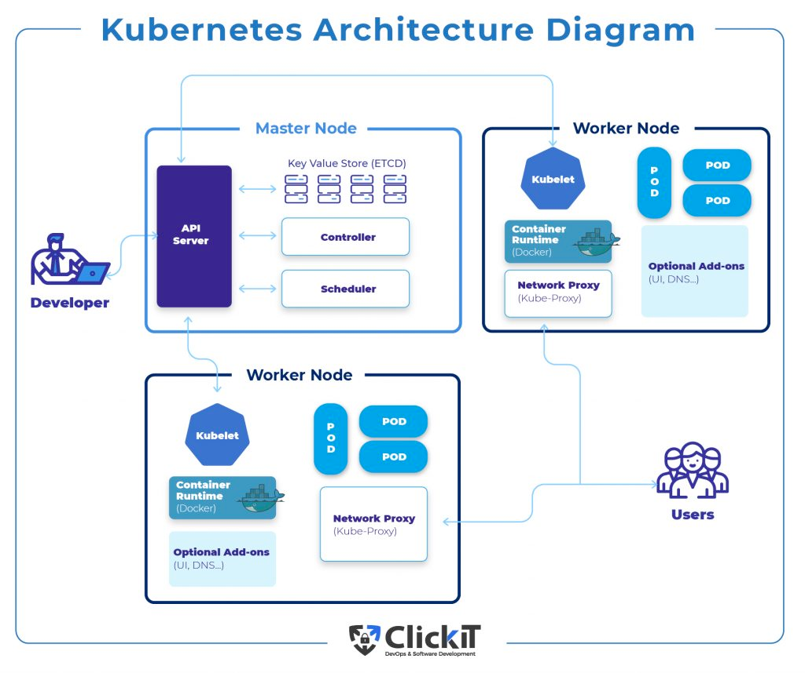
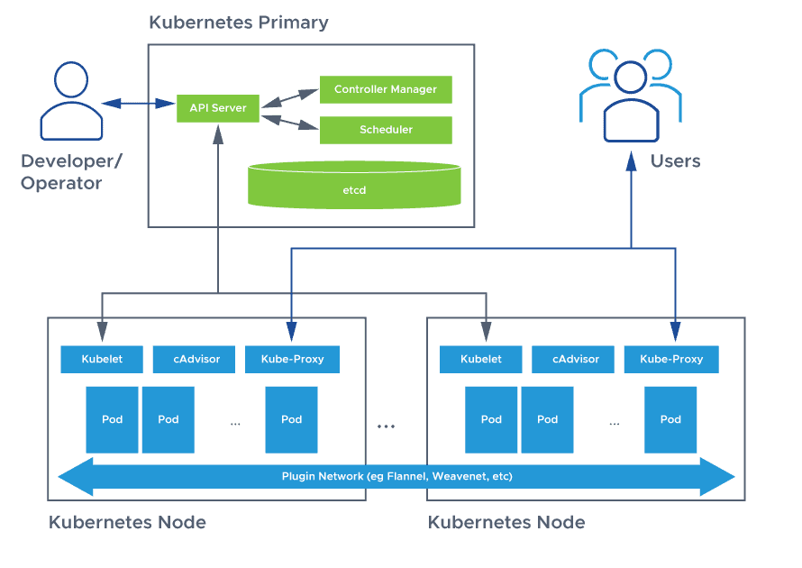

# Kubernetes Architecture

[[k8s docs] Kubernetes Components](https://kubernetes.io/docs/concepts/overview/components/)  

[[seongjin] 쿠버네티스의 클러스터 개념과 구성 컴포넌트 알아보기](https://seongjin.me/kubernetes-cluster-components/)  
[[sysdig] How to Monitor Kubernetes API Server](https://sysdig.com/blog/monitor-kubernetes-api-server/?ref=seongjin.me)
[[clickit] Kubernetes Architecture Diagram: The Complete Explanation](https://www.clickittech.com/devops/kubernetes-architecture-diagram/)
[[avi networks] Kubernetes Architecture](https://avinetworks.com/glossary/kubernetes-architecture/)

## Control Plain (Master)

### API 서버(kube-apiserver) : 클러스터 구성 요소들의 상호 통신에 필요한 쿠버네티스 API를 관리하는 컴포넌트
- 쿠버네티스 시스템 컴포넌트는 오직 API 서버와 통신
- 컴포넌트끼리 서로 직접 통신 X
- 때문에 etcd와 통신하는 유일한 컴포넌트 API 서버
- RESTful API를 통해 클러스터 상태를 쿼리, 수정할 수 있는 기능 제공
- API 서버의 구체적인 역할
    - 인증 플러그인을 사용한 클라이언트 인증
    - 권한 승인 플러그인을 통한 클라이언트 인증
    - 승인 제어 플러그인을 통해 요청 받은 리소스를 확인/수정
    - 리소스 검증 및 영구 저장

### 컨트롤러 매니저(kube-controller-manager) : 노드(Node), 디플로이먼트(Deployment), 서비스 어카운트(Service Account) 등 클러스터에서 구동되는 리소스들을 유지 관리하는 프로세스들의 집합
- API 궁극적으로 아무 역할을 하지 않음
- 컨트롤러에는 다양한 컨트롤러가 존재
- 이 컨트롤러는 API에 의해 받아진 요청을 처리하는 역할
    - 레플리케이션 매니저(레플리케이션 컨트롤러)
    - 레플리카셋, 데몬셋, 잡 컨트롤러
    - 디플로이먼트 컨트롤러
    - 스테이트풀셋 컨트롤러
    - 노드 컨트롤러
    - 서비스 컨트롤러
    - 엔드포인트 컨트롤러
    - 네임스페이스 컨트롤러
    - 영구 볼륨 컨트롤러
    - etc

### 스케줄러(kube-scheduler) : 애플리케이션 구동에 필요한 각 컨테이너에 대해 클러스터 내 최적의 배포를 수행하는 스케줄러
- 일반적으로 실행할 노드를 직접 정해주지 않음
- 요청 받은 리소스를 어느 노드에 실행할지 결정하는 역할
- 현재 노드의 상태를 점검하고 최상의 노드를 찾아 배치
- 다수의 포드를 배치하는 경우에는 라운드로빈을 사용하여 분산

### etcd : 클러스터 안의 각 구성요소들에 대한 정보가 키-값 형태로 저장된 데이터베이스
### DNS 서버 : 클러스터 안에서 특정 도메인을 찾을 때 사용되는 네임 서버 (구성도에는 kube-dns라 되어 있으나, 쿠버네티스 1.12 버전부터는 CoreDNS로 대체됨)

## Worker Node

### kubelet : 클러스터의 각 노드에서 API 서버를 통해 들어오는 신호를 모니터링하고 파드에서 컨테이너가 제 기능대로 정상 동작하도록 관리하는 에이전트
### kube-proxy : 클러스터의 각 노드에서 실행되는 네트워크 프록시 서비스
### 컨테이너 런타임 엔진(container runtime engine) : 노드에 배포된 파드(Pod) 내 컨테이너들을 구동시키는 엔진
