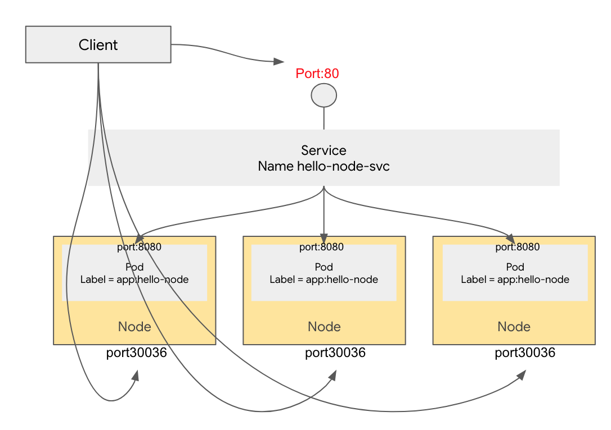
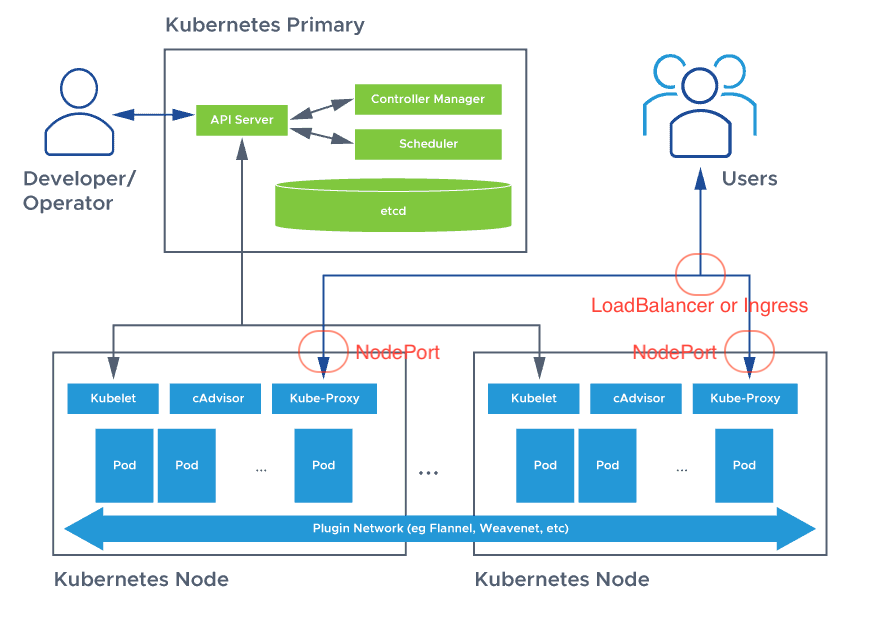

# NodePort

[[k8s docs] NodePort](https://kubernetes.io/docs/concepts/services-networking/service/#type-nodeport)
[[조대협] 쿠버네티스 #7 - 서비스 (Service)](https://bcho.tistory.com/1262)



- 30000-32767 포트만 사용가능
- nodePort 미설정시 랜덤한 포트로 설정

## 노드포트를 활용한 로드밸런싱


- 사용자들은 마스터 노드로 붙지 않는다
  - 서비스되는 파드들은 워커노드에 배치되기 때문에
  - 따라서 워커노드의 큐브프록시로 접근한다
- 큐브프록시(서비스)는 요청을 적절한 파드로 연결한다

## 노드포트 테스트

[http-go-deploy.yaml](./yaml/http-go-deploy.yaml)  
[http-go-np.yaml](./yaml/http-go-np.yaml)

```bash
kubectl apply -f http-go-deploy.yaml
kubectl apply -f http-go-np.yaml
```

NodePort 는 External-IP를 받지 않음


```bash
kubectl get svc

NAME         TYPE        CLUSTER-IP     EXTERNAL-IP   PORT(S)        AGE
http-go-np   NodePort    10.96.238.51   <none>        80:30001/TCP   7s
```

```bash
kubectl get nodes -o wide

NAME     STATUS   ROLES           AGE   VERSION   INTERNAL-IP     EXTERNAL-IP   OS-IMAGE             KERNEL-VERSION    CONTAINER-RUNTIME
k8s-01   Ready    control-plane   11d   v1.28.2   192.168.0.67    <none>        Ubuntu 20.04.6 LTS   5.15.0-1053-aws   containerd://1.6.28
k8s-02   Ready    <none>          11d   v1.28.2   192.168.0.193   <none>        Ubuntu 20.04.6 LTS   5.15.0-1052-aws   containerd://1.6.28
k8s-03   Ready    <none>          11d   v1.28.2   192.168.0.108   <none>        Ubuntu 20.04.6 LTS   5.15.0-1053-aws   containerd://1.6.28
```

```bash
# 외부 아이피 30001 포트 호출
curl xxx.xxx.xxx.xxx:30001 # k8s-01
curl xxx.xxx.xxx.xxx:30001 # k8s-02
curl xxx.xxx.xxx.xxx:30001 # k8s-03

# 내부 아이피 30001 포트 호출
curl 192.168.0.67:30001  # k8s-01
curl 192.168.0.193:30001 # k8s-02
curl 192.168.0.108:30001 # k8s-03

# 서비스 아이피 80 포트 호출
curl 10.96.238.51

# 파드 내부에서 서비스 도메인으로 80 포트 호출
kubectl run -it --rm --image=busybox -- sh
wget -O- -q http-go-np
```
