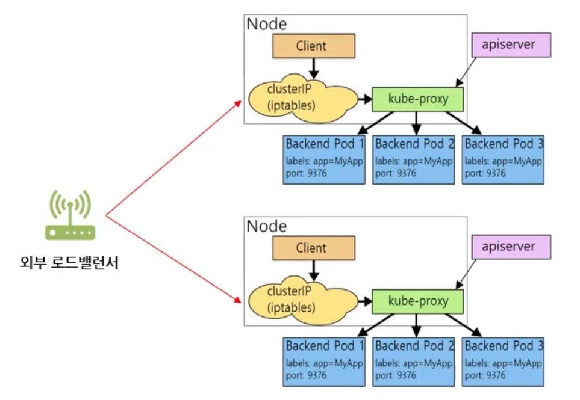

# LoadBalancer

[AWS Load Balancer Controller](https://aws.amazon.com/ko/blogs/containers/introducing-aws-load-balancer-controller/)

- NodePort 서비스의 확장된 서비스
- 클라우드 서비스에서 사용 가능
- yaml 파일에서 타입을 LoadBalancer 설정
- 로드 밸런서의 IP 주소를 통해 서비스에 엑세스

## 로드밸런스 서비스의 패킷 흐름

- 클러스터에 로드밸런싱을 해주는 개체 필요
- 로드밸런스는 노드포트의 기능을 포함



```yaml
apiVersion: v1
kind: Service
metadata:
  name: http-go-lb
spec:
  type: LoadBalancer
  selector:
    app: http-go
  ports:
  - port: 80          # 서비스의 포트 (최종적으로 서비스할 포트)
    protocol: TCP     
    targetPort: 8080  # 파드의 포트
```

```bash
kubectl apply -f http-go-lb.yaml
```

```bash
kubectl get svc

NAME         TYPE           CLUSTER-IP      EXTERNAL-IP   PORT(S)        AGE
http-go-lb   LoadBalancer   10.99.131.194   x.x.x.x       80:30135/TCP   8s
```

```bash
# 로드밸런서 호출
curl x.x.x.x # EXTERNAL-IP

# 외부 아이피 30135 포트 호출
curl xxx.xxx.xxx.xxx:30135 # k8s-01
curl xxx.xxx.xxx.xxx:30135 # k8s-02
curl xxx.xxx.xxx.xxx:30135 # k8s-03

# 내부 아이피 30135 포트 호출
curl 192.168.0.67:30135  # k8s-01
curl 192.168.0.193:30135 # k8s-02
curl 192.168.0.108:30135 # k8s-03

# 서비스 아이피 80 포트 호출
curl 10.99.131.194

# 파드 내부에서 서비스 도메인으로 80 포트 호출
kubectl run -it --rm --image=busybox -- sh
wget -O- -q http-go-lb
```
