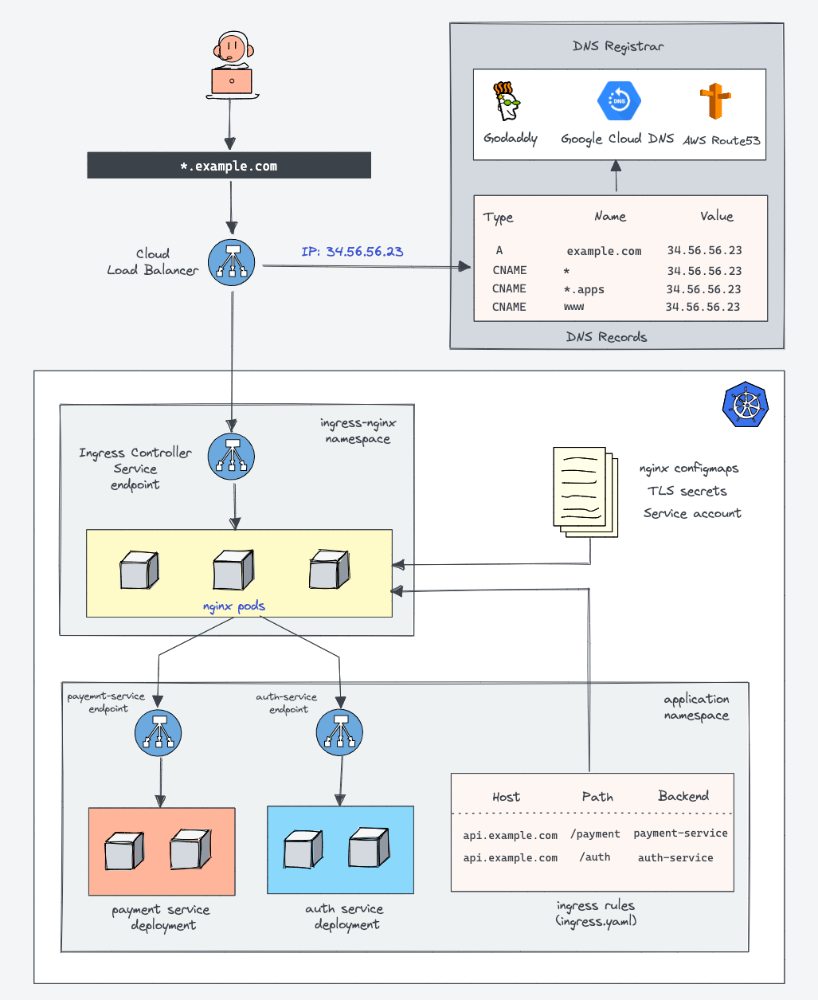
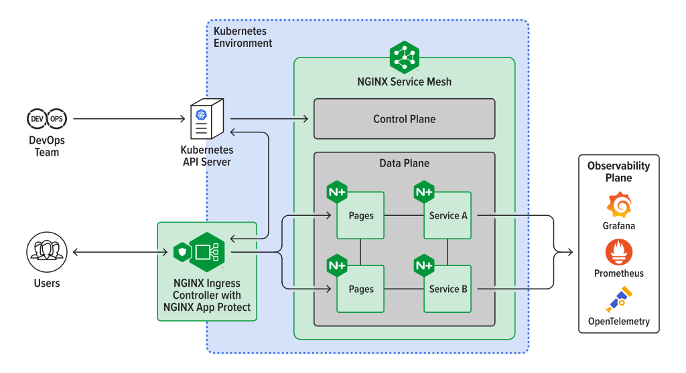

# Ingress

[[k8s docs] Ingress](https://kubernetes.io/docs/concepts/services-networking/ingress/)  
[[k8s docs] Ingress Controller](https://kubernetes.io/docs/concepts/services-networking/ingress-controllers/)  

[[devopscube] Kubernetes Ingress Tutorial For Beginners](https://devopscube.com/kubernetes-ingress-tutorial/)  

하나의 IP 또는 도메인으로 다수의 서비스 제공



## [Path types](https://kubernetes.io/docs/concepts/services-networking/ingress/#examples)

- ImplementationSpecific: With this path type, matching is up to the IngressClass. Implementations can treat this as a separate pathType or treat it identically to Prefix or Exact path types.
- Exact: Matches the URL path exactly and with case sensitivity.
- Prefix: Matches based on a URL path prefix split by /. Matching is case sensitive and done on a path element by element basis. A path element refers to the list of labels in the path split by the / separator. A request is a match for path p if every p is an element-wise prefix of p of the request path.

## [Nginx Ingress Controller](https://github.com/kubernetes/ingress-nginx)



- 프라이빗 환경에서 인그레스를 사용할 수 있는 ingress-nginx 설치
- 쿠버네티스에 파드 형태로 띄워서 설정하는 방법
- nginx-ingress가 파드로 떠있으면서 다시 서비스로 연결할 수 있는 역할을 수행

### [Nginx ingress 설치](https://kubernetes.github.io/ingress-nginx/deploy/)

```bash
git clone https://github.com/kubernetes/ingress-nginx/
kubectl apply -k `pwd`/ingress-nginx/deploy/static/provider/baremetal/
# kubectl delete validatingwebhookconfigurations.admissionregistration.k8s.io ingress-nginx-admission
# webhook 구성 삭제 명령
# webhook 기능으로 ingress가 정상적으로 동작되지 않는 현상이 있음
```

```bash
kubectl get all -n ingress-nginx

NAME                                            READY   STATUS      RESTARTS   AGE
pod/ingress-nginx-admission-create-5gscm        0/1     Completed   0          2m26s
pod/ingress-nginx-admission-patch-kbmtk         0/1     Completed   1          2m26s
pod/ingress-nginx-controller-55754d7d8b-gc8lp   1/1     Running     0          2m26s

NAME                                         TYPE        CLUSTER-IP       EXTERNAL-IP   PORT(S)                      AGE
service/ingress-nginx-controller             NodePort    10.102.208.171   <none>        80:31266/TCP,443:31547/TCP   2m26s
service/ingress-nginx-controller-admission   ClusterIP   10.109.205.23    <none>        443/TCP                      2m26s

NAME                                       READY   UP-TO-DATE   AVAILABLE   AGE
deployment.apps/ingress-nginx-controller   1/1     1            1           2m26s

NAME                                                  DESIRED   CURRENT   READY   AGE
replicaset.apps/ingress-nginx-controller-55754d7d8b   1         1         1       2m26s

NAME                                       COMPLETIONS   DURATION   AGE
job.batch/ingress-nginx-admission-create   1/1           7s         2m26s
job.batch/ingress-nginx-admission-patch    1/1           8s         2m26s
```

### Ingress 테스트

```bash
kubectl apply -f http-go-ingress.yaml
```

```bash
kubectl get ing
kubectl get ing -o yaml

NAME              CLASS   HOSTS   ADDRESS         PORTS   AGE
http-go-ingress   nginx   *       192.168.0.108   80      4m47s
```

```bash
# kubectl apply -f http-go-deploy.yaml
kubectl create deployment http-go --image=gasbugs/http-go:ingress
kubectl expose deployment http-go --port=80 --target-port=8080
```

```bash
curl 127.0.0.1:31266 # (service/ingress-nginx-controller)
curl 10.102.208.171 # (service/ingress-nginx-controller)

<html>
<head><title>404 Not Found</title></head>
<body>
<center><h1>404 Not Found</h1></center>
<hr><center>nginx</center>
</body>
</html>
```

```bash
curl 127.0.0.1:31266/welcome/test
curl 10.102.208.171/welcome/test

Welcome! http-go-7fd8fc8d7b-qlshc
```


