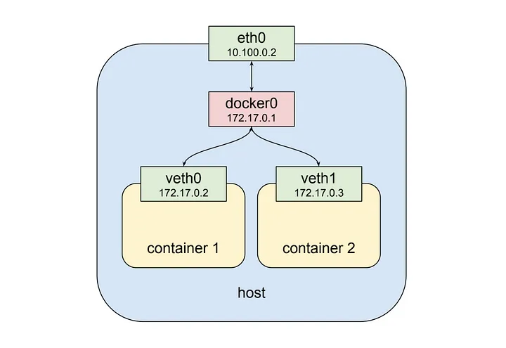
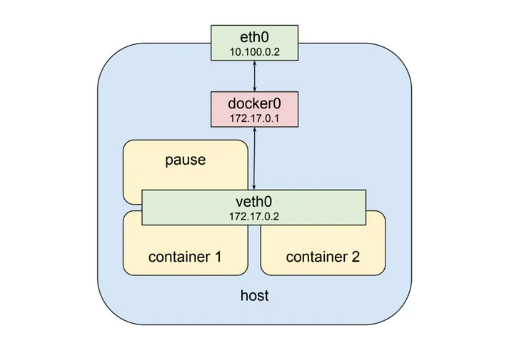

# 1. 한 포드에 있는 다수의 컨테이너끼리 통신

## 도커의 기본적인 네트워크 동작 구조



Docker에서는 기본적으로 같은 노드(host) 내의 컨테이너 끼리의 통신은 위 그림과 같이 docker0라는 가상 네트워크 인터페이스(172.17.0.0/24)를 통해 가능하다.

또한 각 컨테이너는 veth라는 가상 네트워크 인터페이스를 고유하게 가지며 따라서 각각의 veth IP 주소 값으로 통신할 수 있다.

## 쿠버네티스 파드내 컨테이너들의 네트워크 동작 구조



위 그림에서는 veth0 가상 네트워크 인터페이스에 두 개의 컨테이너가 동시에 할당되어 있다.

즉, 두 개의 컨테이너는 모두 veth0 라는 동일한 네트워크를 사용하는 것이다.

> pause 명령을 실행해 아무 동작 하지 않는 빈 컨테이너를 생성  
> 이를 통해 veth0 공유 네트워크를 생성한다

그렇다면 외부에서는 두 개의 컨테이너가 동일한 IP로 보일 텐데 각 컨테이너를 어떻게 구분할까? 또한 컨테이너 끼리는 서로를 어떻게 구분할까?

**veth0 안에서 각 컨테이너는 고유한 port 번호로 서로를 구분한다.**

따라서 Pod 내에서 컨테이너는 각자 고유한 port 번호를 사용해야한다. (같은 포트 사용시 충돌)

이러한 네트워크 인터페이스를 제공해주는 특별한 컨테이너들이 있다.

kubernetes Pod가 실행되고 있는 워커 노드에 들어가서 docker ps 명령어를 입력하면 적어도 한 개 이상의 pause 라는 명령으로 실행된 컨테이너를 볼 수 있다.

이 특별한 컨테이너들은 각 Pod마다 존재하며 다른 컨테이너들에게 네트워크 인터페이스를 제공하는 역할만 담당한다.

```bash
ctr ns ls

NAME   LABELS
k8s.io
```

```bash
ctr -n k8s.io containers list

CONTAINER                                                           IMAGE                                                                                                                         RUNTIME
06a9d62e9aeb994b2b38ec2fbcf11e38e856f306fd2a8296a33949251616e491    quay.io/cilium/cilium@sha256:9cfd6a0a3a964780e73a11159f93cc363e616f7d9783608f62af6cfdf3759619                                 io.containerd.runc.v2
0729236a943956ed1dc2b9a8c63bb1d5976c0f9d50dee58b99f8a3db9471dfca    registry.k8s.io/coredns/coredns:v1.10.1                                                                                       io.containerd.runc.v2
154b4dab6b5c5c12130e76e5284390c4b459654fc2781edcbe636c0c7c66edc5    registry.k8s.io/pause:3.6                                                                                                     io.containerd.runc.v2
217696ff61a233ddfec86b6f418b3fdb42f02f0704d27fe46f1031b6f504c133    registry.k8s.io/pause:3.6                                                                                                     io.containerd.runc.v2
3557894e60c1003a6412ca747c9cedab34e38f7220c0f475791c8f916ec1b1ec    docker.io/gasbugs/http-go:ingress                                                                                             io.containerd.runc.v2
35f711108d15eb0e22eccf075fc52c04a0b482df77f5e58c8c6b9f42328e1464    registry.k8s.io/kube-proxy:v1.28.6                                                                                            io.containerd.runc.v2
3ab7e2186017e280d24cd26e1a38470f4c6e874d5fe8acc663524ea93bd6c5d9    quay.io/cilium/cilium@sha256:9cfd6a0a3a964780e73a11159f93cc363e616f7d9783608f62af6cfdf3759619                                 io.containerd.runc.v2
575bebb6cf4dde106f9da921bfa4c74e038fe6bee64561b9f4e1327edbef720b    registry.k8s.io/pause:3.6                                                                                                     io.containerd.runc.v2
5aa5715f2afebe34e8e829e794f01adffc4b5c0faa313a1421833a172941e239    registry.k8s.io/coredns/coredns:v1.10.1                                                                                       io.containerd.runc.v2
6b471a08bbc645760690f33af3db5d583268798d81390761fa2ee2bdc312961d    registry.k8s.io/pause:3.6                                                                                                     io.containerd.runc.v2
6cbd60cdf9c583c1ab566f29c090ff6217a160a464193255c9d99237144391e3    registry.k8s.io/coredns/coredns:v1.10.1                                                                                       io.containerd.runc.v2
79d55488dd75a48c782a816a43048831546c89188c6a7a07b644758a46b0be2b    registry.k8s.io/pause:3.6                                                                                                     io.containerd.runc.v2
8765860b2d45a9c87b54a7346d96e36f01d517de9fcc2452c4b708a857d3463d    registry.k8s.io/kube-proxy:v1.28.6                                                                                            io.containerd.runc.v2
9d9a764ad4e68edada7c85c9103551769360aed3f57270c9e9d80657f9b29ba1    quay.io/cilium/cilium@sha256:9cfd6a0a3a964780e73a11159f93cc363e616f7d9783608f62af6cfdf3759619                                 io.containerd.runc.v2
a4d6e85971d94caa96ddd841200a3e2949f71d5b7663971cae7da2e3724f3528    registry.k8s.io/pause:3.6                                                                                                     io.containerd.runc.v2
ae7baca1d14d9a99858f4d1641d03f51fd4ff9be0ce57f7c64aa15a6dc3c678c    quay.io/cilium/cilium@sha256:9cfd6a0a3a964780e73a11159f93cc363e616f7d9783608f62af6cfdf3759619                                 io.containerd.runc.v2
b51c502e9f8cb54c84f457812c53e9c7b6a2f21970b240c0078445947131e6b3    quay.io/cilium/cilium@sha256:9cfd6a0a3a964780e73a11159f93cc363e616f7d9783608f62af6cfdf3759619                                 io.containerd.runc.v2
bfa9d0696e2c2fb277ca5d855e14d7d98efca1f62c281dd4a4d1efaabf7bfa83    registry.k8s.io/pause:3.6                                                                                                     io.containerd.runc.v2
c26061d621f475a0af533bd8ea58f2f59fcfaef7492d16de722a066ba3e8550d    registry.k8s.io/pause:3.6                                                                                                     io.containerd.runc.v2
c55d966275d7751b7f78a876e03ff8bee4283e0f74d6ffe426aafca2cb7bf507    registry.k8s.io/pause:3.6                                                                                                     io.containerd.runc.v2
c78e091ebb8c11f52a4f77253815ae79753254af8c18a680670bee332eecc23c    quay.io/cilium/cilium@sha256:9cfd6a0a3a964780e73a11159f93cc363e616f7d9783608f62af6cfdf3759619                                 io.containerd.runc.v2
c85b0bae6b89f4f8c1c9c62b4cf08f8c1f198e9346b79ea98072e0ab3472d27f    quay.io/cilium/cilium@sha256:9cfd6a0a3a964780e73a11159f93cc363e616f7d9783608f62af6cfdf3759619                                 io.containerd.runc.v2
d39c68c703222c38875501ccf04b28a71254b6e83a8288bc304a000f18892481    registry.k8s.io/coredns/coredns:v1.10.1                                                                                       io.containerd.runc.v2
d8867cf2b716bc445b1fd85fc9923e7d85b68711bae9b9c1e731377f7e40e5c8    registry.k8s.io/pause:3.6                                                                                                     io.containerd.runc.v2
e0b2fb94f45797f9e130446e599b1ed2d251f690db037eba54845517b1d32932    quay.io/cilium/cilium@sha256:9cfd6a0a3a964780e73a11159f93cc363e616f7d9783608f62af6cfdf3759619                                 io.containerd.runc.v2
f1aabd861e7276829e3dd0d0a16a42150a671d6f36e3138da55a1023206f507e    registry.k8s.io/ingress-nginx/kube-webhook-certgen@sha256:25d6a5f11211cc5c3f9f2bf552b585374af287b4debf693cacbe2da47daa5084    io.containerd.runc.v2

ctr -n k8s.io containers list | grep pause

CONTAINER                                                           IMAGE                                                                                                                         RUNTIME
154b4dab6b5c5c12130e76e5284390c4b459654fc2781edcbe636c0c7c66edc5    registry.k8s.io/pause:3.6                                                                                                     io.containerd.runc.v2
217696ff61a233ddfec86b6f418b3fdb42f02f0704d27fe46f1031b6f504c133    registry.k8s.io/pause:3.6                                                                                                     io.containerd.runc.v2
575bebb6cf4dde106f9da921bfa4c74e038fe6bee64561b9f4e1327edbef720b    registry.k8s.io/pause:3.6                                                                                                     io.containerd.runc.v2
6b471a08bbc645760690f33af3db5d583268798d81390761fa2ee2bdc312961d    registry.k8s.io/pause:3.6                                                                                                     io.containerd.runc.v2
79d55488dd75a48c782a816a43048831546c89188c6a7a07b644758a46b0be2b    registry.k8s.io/pause:3.6                                                                                                     io.containerd.runc.v2
a4d6e85971d94caa96ddd841200a3e2949f71d5b7663971cae7da2e3724f3528    registry.k8s.io/pause:3.6                                                                                                     io.containerd.runc.v2
bfa9d0696e2c2fb277ca5d855e14d7d98efca1f62c281dd4a4d1efaabf7bfa83    registry.k8s.io/pause:3.6                                                                                                     io.containerd.runc.v2
c26061d621f475a0af533bd8ea58f2f59fcfaef7492d16de722a066ba3e8550d    registry.k8s.io/pause:3.6                                                                                                     io.containerd.runc.v2
c55d966275d7751b7f78a876e03ff8bee4283e0f74d6ffe426aafca2cb7bf507    registry.k8s.io/pause:3.6                                                                                                     io.containerd.runc.v2
d8867cf2b716bc445b1fd85fc9923e7d85b68711bae9b9c1e731377f7e40e5c8    registry.k8s.io/pause:3.6                                                                                                     io.containerd.runc.v2
```

Pod가 돌아가고 있는 워커 노드에서 docker ps 명령어를 입력하면 이런 컨테이너들을 확인할 수 있다.

pause 명령으로 실행된 컨테이너는 kubernetes가 SIGTERM 명령을 내리기 전까지 아무것도 하지 않고 sleep 상태로 존재한다.
