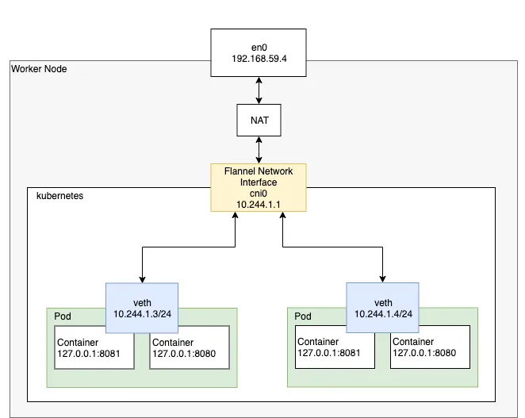
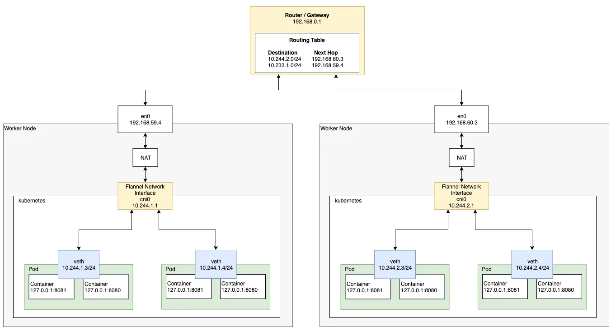
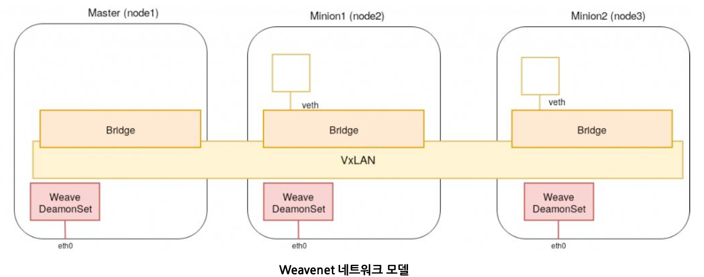

# 파드끼리 통신

- 파드끼리 통신을 위해서 CNI 플러그인이 필요
- ACI, AOS, AWS VPN CNI, CNI-Genie, GCE, flannel, Weave Net, Calico 등

## 싱글 노드 Pod 네트워크



기본적으로 kubernetes는 kubenet이라는 아주 기본적이고 간단한 네트워크 플러그인을 제공 해주지만, 정말로 매우 기본적이고 간단한 기능만 제공해주는 네트워크 플러그인이기 때문에 이 자체로는 크로스 노드 네트워킹이나 네트워크 정책 설정과 같은 고급 기능은 구현되어 있지 않다.

따라서 kubernetes에서는 Pod 네트워킹 인터페이스로 CNI 스펙을 준수하는 다양한 네트워크 플러그인을 사용하는 것을 권장한다. (kubernetes에서 제공해주는 클러스터 빌드 전용 커맨드라인 인터페이스인 kubeadm은 기본적으로 CNI 기반 네트워크 플러그인만 사용할 수 있도록 되어있다.)

Pod의 특징 중 하나로 각 Pod는 고유한 IP 주소를 가진다. (이것이 위에서 설명한 가상 네트워크 인터페이스 veth이다.)

따라서 각 Pod는 kubenet 혹은 CNI 로 구성된 네트워크 인터페이스를 통하여 고유한 IP 주소로 서로 통신할 수 있다.

## 멀티 노드 Pod 네트워크





여러 개의 워커 노드 사이에 각각 다른 노드에 존재하는 Pod가 서로 통신하려면 라우터를 거쳐서 통신하게 된다.

## 프로세스 및 포트 확인

- 마스터 노드와 워커 노드끼리 통신하고 있는 내역을 확인할 수 있다

```bash
kubectl get nodes -o wide

NAME     STATUS   ROLES           AGE   VERSION   INTERNAL-IP     EXTERNAL-IP   OS-IMAGE             KERNEL-VERSION    CONTAINER-RUNTIME
k8s-01   Ready    control-plane   15d   v1.28.2   192.168.0.67    <none>        Ubuntu 20.04.6 LTS   5.15.0-1053-aws   containerd://1.6.28
k8s-02   Ready    <none>          15d   v1.28.2   192.168.0.193   <none>        Ubuntu 20.04.6 LTS   5.15.0-1052-aws   containerd://1.6.28
k8s-03   Ready    <none>          15d   v1.28.2   192.168.0.108   <none>        Ubuntu 20.04.6 LTS   5.15.0-1053-aws   containerd://1.6.28
```

```bash
sudo netstat -antp | grep cilium

Active Internet connections (servers and established)
Proto Recv-Q Send-Q Local Address           Foreign Address         State       PID/Program name
tcp        0      0 127.0.0.1:46431         0.0.0.0:*               LISTEN      2029/cilium-agent
tcp        0      0 192.168.0.67:4240       0.0.0.0:*               LISTEN      2029/cilium-agent
tcp        0      0 127.0.0.1:9890          0.0.0.0:*               LISTEN      2029/cilium-agent
tcp        0      0 127.0.0.1:9879          0.0.0.0:*               LISTEN      2029/cilium-agent
tcp        0      0 10.0.1.76:54868         10.0.2.251:4240         ESTABLISHED 2029/cilium-agent
tcp        0      0 192.168.0.67:4240       192.168.0.67:49250      ESTABLISHED 2029/cilium-agent
tcp        0      0 192.168.0.67:4240       192.168.0.193:44020     ESTABLISHED 2029/cilium-agent
tcp        0      0 192.168.0.67:53978      10.96.0.1:443           ESTABLISHED 2029/cilium-agent
tcp        0      0 192.168.0.67:49250      192.168.0.67:4240       ESTABLISHED 2029/cilium-agent
tcp        0      0 10.0.1.76:37584         10.0.0.109:4240         ESTABLISHED 2029/cilium-agent
tcp        0      0 10.0.1.76:50590         10.0.1.65:4240          ESTABLISHED 2029/cilium-agent
tcp        0      0 192.168.0.67:4240       192.168.0.108:39598     ESTABLISHED 2029/cilium-agent
tcp        0      0 192.168.0.67:44636      192.168.0.108:4240      ESTABLISHED 2029/cilium-agent
tcp        0      0 192.168.0.67:60268      192.168.0.193:4240      ESTABLISHED 2029/cilium-agent
tcp6       0      0 :::4244                 :::*                    LISTEN      2029/cilium-agent
tcp6       0      0 :::9962                 :::*                    LISTEN      2029/cilium-agent
```

```bash
ps -eaf | grep 2029

UID          PID    PPID  C STIME TTY          TIME CMD
root        2029    1386  0 Feb09 ?        02:05:56 cilium-agent --config-dir=/tmp/cilium/config-map
root        2277    2029  0 Feb09 ?        00:00:20 cilium-health-responder --listen 4240 --pidfile /var/run/cilium/state/health-endpoint.pid
```

```bash
ifconfig

cilium_host: flags=4291<UP,BROADCAST,RUNNING,NOARP,MULTICAST>  mtu 9001
        inet 10.0.1.76  netmask 255.255.255.255  broadcast 0.0.0.0
        inet6 fe80::5cd2:caff:fe0a:b710  prefixlen 64  scopeid 0x20<link>
        ether 5e:d2:ca:0a:b7:10  txqueuelen 1000  (Ethernet)
        RX packets 163610  bytes 12654723 (12.6 MB)
        RX errors 0  dropped 0  overruns 0  frame 0
        TX packets 680  bytes 47376 (47.3 KB)
        TX errors 0  dropped 0 overruns 0  carrier 0  collisions 0

cilium_net: flags=4291<UP,BROADCAST,RUNNING,NOARP,MULTICAST>  mtu 9001
        inet6 fe80::4043:7bff:fe86:7ebf  prefixlen 64  scopeid 0x20<link>
        ether 42:43:7b:86:7e:bf  txqueuelen 1000  (Ethernet)
        RX packets 680  bytes 47376 (47.3 KB)
        RX errors 0  dropped 0  overruns 0  frame 0
        TX packets 163610  bytes 12654723 (12.6 MB)
        TX errors 0  dropped 0 overruns 0  carrier 0  collisions 0

cilium_vxlan: flags=4163<UP,BROADCAST,RUNNING,MULTICAST>  mtu 9001
        inet6 fe80::472:1cff:fe4a:28af  prefixlen 64  scopeid 0x20<link>
        ether 06:72:1c:4a:28:af  txqueuelen 1000  (Ethernet)
        RX packets 353510  bytes 22737063 (22.7 MB)
        RX errors 0  dropped 0  overruns 0  frame 0
        TX packets 353605  bytes 22764887 (22.7 MB)
        TX errors 0  dropped 0 overruns 0  carrier 0  collisions 0
```

```bash
kubectl get daemonset cilium -n kube-system -o yaml

apiVersion: apps/v1
kind: DaemonSet
metadata:
  annotations:
    deprecated.daemonset.template.generation: "1"
    meta.helm.sh/release-name: cilium
    meta.helm.sh/release-namespace: kube-system
  creationTimestamp: "2024-02-03T08:43:28Z"
  generation: 1
  labels:
    app.kubernetes.io/managed-by: Helm
    app.kubernetes.io/name: cilium-agent
    app.kubernetes.io/part-of: cilium
    k8s-app: cilium
  name: cilium
  namespace: kube-system
  resourceVersion: "922949"
  uid: ff30da22-554e-4748-bca4-86e26a349dc8
spec:
  revisionHistoryLimit: 10
  selector:
    matchLabels:
      k8s-app: cilium
  template:
    metadata:
      annotations:
        container.apparmor.security.beta.kubernetes.io/apply-sysctl-overwrites: unconfined
        container.apparmor.security.beta.kubernetes.io/cilium-agent: unconfined
        container.apparmor.security.beta.kubernetes.io/clean-cilium-state: unconfined
        container.apparmor.security.beta.kubernetes.io/mount-cgroup: unconfined
      creationTimestamp: null
      labels:
        app.kubernetes.io/name: cilium-agent
        app.kubernetes.io/part-of: cilium
        k8s-app: cilium
    spec:
      affinity:
        podAntiAffinity:
          requiredDuringSchedulingIgnoredDuringExecution:
          - labelSelector:
              matchLabels:
                k8s-app: cilium
            topologyKey: kubernetes.io/hostname
      automountServiceAccountToken: true
      containers:
      - args:
        - --config-dir=/tmp/cilium/config-map
        command:
        - cilium-agent
        env:
        - name: K8S_NODE_NAME
          valueFrom:
            fieldRef:
              apiVersion: v1
              fieldPath: spec.nodeName
        - name: CILIUM_K8S_NAMESPACE
          valueFrom:
            fieldRef:
              apiVersion: v1
              fieldPath: metadata.namespace
        - name: CILIUM_CLUSTERMESH_CONFIG
          value: /var/lib/cilium/clustermesh/
        - name: GOMEMLIMIT
          valueFrom:
            resourceFieldRef:
              divisor: "0"
              resource: limits.memory
        image: quay.io/cilium/cilium:v1.15.0@sha256:9cfd6a0a3a964780e73a11159f93cc363e616f7d9783608f62af6cfdf3759619
        imagePullPolicy: IfNotPresent
        lifecycle:
          postStart:
            exec:
              command:
              - bash
              - -c
              - |
                set -o errexit
                set -o pipefail
                set -o nounset

                # When running in AWS ENI mode, it's likely that 'aws-node' has
                # had a chance to install SNAT iptables rules. These can result
                # in dropped traffic, so we should attempt to remove them.
                # We do it using a 'postStart' hook since this may need to run
                # for nodes which might have already been init'ed but may still
                # have dangling rules. This is safe because there are no
                # dependencies on anything that is part of the startup script
                # itself, and can be safely run multiple times per node (e.g. in
                # case of a restart).
                if [[ "$(iptables-save | grep -E -c 'AWS-SNAT-CHAIN|AWS-CONNMARK-CHAIN')" != "0" ]];
                then
                    echo 'Deleting iptables rules created by the AWS CNI VPC plugin'
                    iptables-save | grep -E -v 'AWS-SNAT-CHAIN|AWS-CONNMARK-CHAIN' | iptables-restore
                fi
                echo 'Done!'
          preStop:
            exec:
              command:
              - /cni-uninstall.sh
        livenessProbe:
          failureThreshold: 10
          httpGet:
            host: 127.0.0.1
            httpHeaders:
            - name: brief
              value: "true"
            path: /healthz
            port: 9879
            scheme: HTTP
          periodSeconds: 30
          successThreshold: 1
          timeoutSeconds: 5
        name: cilium-agent
        readinessProbe:
          failureThreshold: 3
          httpGet:
            host: 127.0.0.1
            httpHeaders:
            - name: brief
              value: "true"
            path: /healthz
            port: 9879
            scheme: HTTP
          periodSeconds: 30
          successThreshold: 1
          timeoutSeconds: 5
        resources: {}
        securityContext:
          capabilities:
            add:
            - CHOWN
            - KILL
            - NET_ADMIN
            - NET_RAW
            - IPC_LOCK
            - SYS_MODULE
            - SYS_ADMIN
            - SYS_RESOURCE
            - DAC_OVERRIDE
            - FOWNER
            - SETGID
            - SETUID
            drop:
            - ALL
          seLinuxOptions:
            level: s0
            type: spc_t
        startupProbe:
          failureThreshold: 105
          httpGet:
            host: 127.0.0.1
            httpHeaders:
            - name: brief
              value: "true"
            path: /healthz
            port: 9879
            scheme: HTTP
          initialDelaySeconds: 5
          periodSeconds: 2
          successThreshold: 1
          timeoutSeconds: 1
        terminationMessagePath: /dev/termination-log
        terminationMessagePolicy: FallbackToLogsOnError
        volumeMounts:
        - mountPath: /host/proc/sys/net
          name: host-proc-sys-net
        - mountPath: /host/proc/sys/kernel
          name: host-proc-sys-kernel
        - mountPath: /sys/fs/bpf
          mountPropagation: HostToContainer
          name: bpf-maps
        - mountPath: /var/run/cilium
          name: cilium-run
        - mountPath: /host/etc/cni/net.d
          name: etc-cni-netd
        - mountPath: /var/lib/cilium/clustermesh
          name: clustermesh-secrets
          readOnly: true
        - mountPath: /lib/modules
          name: lib-modules
          readOnly: true
        - mountPath: /run/xtables.lock
          name: xtables-lock
        - mountPath: /var/lib/cilium/tls/hubble
          name: hubble-tls
          readOnly: true
        - mountPath: /tmp
          name: tmp
      dnsPolicy: ClusterFirst
      hostNetwork: true
      initContainers:
      - command:
        - cilium-dbg
        - build-config
        env:
        - name: K8S_NODE_NAME
          valueFrom:
            fieldRef:
              apiVersion: v1
              fieldPath: spec.nodeName
        - name: CILIUM_K8S_NAMESPACE
          valueFrom:
            fieldRef:
              apiVersion: v1
              fieldPath: metadata.namespace
        image: quay.io/cilium/cilium:v1.15.0@sha256:9cfd6a0a3a964780e73a11159f93cc363e616f7d9783608f62af6cfdf3759619
        imagePullPolicy: IfNotPresent
        name: config
        resources: {}
        terminationMessagePath: /dev/termination-log
        terminationMessagePolicy: FallbackToLogsOnError
        volumeMounts:
        - mountPath: /tmp
          name: tmp
      - command:
        - sh
        - -ec
        - |
          cp /usr/bin/cilium-mount /hostbin/cilium-mount;
          nsenter --cgroup=/hostproc/1/ns/cgroup --mount=/hostproc/1/ns/mnt "${BIN_PATH}/cilium-mount" $CGROUP_ROOT;
          rm /hostbin/cilium-mount
        env:
        - name: CGROUP_ROOT
          value: /run/cilium/cgroupv2
        - name: BIN_PATH
          value: /opt/cni/bin
        image: quay.io/cilium/cilium:v1.15.0@sha256:9cfd6a0a3a964780e73a11159f93cc363e616f7d9783608f62af6cfdf3759619
        imagePullPolicy: IfNotPresent
        name: mount-cgroup
        resources: {}
        securityContext:
          capabilities:
            add:
            - SYS_ADMIN
            - SYS_CHROOT
            - SYS_PTRACE
            drop:
            - ALL
          seLinuxOptions:
            level: s0
            type: spc_t
        terminationMessagePath: /dev/termination-log
        terminationMessagePolicy: FallbackToLogsOnError
        volumeMounts:
        - mountPath: /hostproc
          name: hostproc
        - mountPath: /hostbin
          name: cni-path
      - command:
        - sh
        - -ec
        - |
          cp /usr/bin/cilium-sysctlfix /hostbin/cilium-sysctlfix;
          nsenter --mount=/hostproc/1/ns/mnt "${BIN_PATH}/cilium-sysctlfix";
          rm /hostbin/cilium-sysctlfix
        env:
        - name: BIN_PATH
          value: /opt/cni/bin
        image: quay.io/cilium/cilium:v1.15.0@sha256:9cfd6a0a3a964780e73a11159f93cc363e616f7d9783608f62af6cfdf3759619
        imagePullPolicy: IfNotPresent
        name: apply-sysctl-overwrites
        resources: {}
        securityContext:
          capabilities:
            add:
            - SYS_ADMIN
            - SYS_CHROOT
            - SYS_PTRACE
            drop:
            - ALL
          seLinuxOptions:
            level: s0
            type: spc_t
        terminationMessagePath: /dev/termination-log
        terminationMessagePolicy: FallbackToLogsOnError
        volumeMounts:
        - mountPath: /hostproc
          name: hostproc
        - mountPath: /hostbin
          name: cni-path
      - args:
        - mount | grep "/sys/fs/bpf type bpf" || mount -t bpf bpf /sys/fs/bpf
        command:
        - /bin/bash
        - -c
        - --
        image: quay.io/cilium/cilium:v1.15.0@sha256:9cfd6a0a3a964780e73a11159f93cc363e616f7d9783608f62af6cfdf3759619
        imagePullPolicy: IfNotPresent
        name: mount-bpf-fs
        resources: {}
        securityContext:
          privileged: true
        terminationMessagePath: /dev/termination-log
        terminationMessagePolicy: FallbackToLogsOnError
        volumeMounts:
        - mountPath: /sys/fs/bpf
          mountPropagation: Bidirectional
          name: bpf-maps
      - command:
        - /init-container.sh
        env:
        - name: CILIUM_ALL_STATE
          valueFrom:
            configMapKeyRef:
              key: clean-cilium-state
              name: cilium-config
              optional: true
        - name: CILIUM_BPF_STATE
          valueFrom:
            configMapKeyRef:
              key: clean-cilium-bpf-state
              name: cilium-config
              optional: true
        - name: WRITE_CNI_CONF_WHEN_READY
          valueFrom:
            configMapKeyRef:
              key: write-cni-conf-when-ready
              name: cilium-config
              optional: true
        image: quay.io/cilium/cilium:v1.15.0@sha256:9cfd6a0a3a964780e73a11159f93cc363e616f7d9783608f62af6cfdf3759619
        imagePullPolicy: IfNotPresent
        name: clean-cilium-state
        resources: {}
        securityContext:
          capabilities:
            add:
            - NET_ADMIN
            - SYS_MODULE
            - SYS_ADMIN
            - SYS_RESOURCE
            drop:
            - ALL
          seLinuxOptions:
            level: s0
            type: spc_t
        terminationMessagePath: /dev/termination-log
        terminationMessagePolicy: FallbackToLogsOnError
        volumeMounts:
        - mountPath: /sys/fs/bpf
          name: bpf-maps
        - mountPath: /run/cilium/cgroupv2
          mountPropagation: HostToContainer
          name: cilium-cgroup
        - mountPath: /var/run/cilium
          name: cilium-run
      - command:
        - /install-plugin.sh
        image: quay.io/cilium/cilium:v1.15.0@sha256:9cfd6a0a3a964780e73a11159f93cc363e616f7d9783608f62af6cfdf3759619
        imagePullPolicy: IfNotPresent
        name: install-cni-binaries
        resources:
          requests:
            cpu: 100m
            memory: 10Mi
        securityContext:
          capabilities:
            drop:
            - ALL
          seLinuxOptions:
            level: s0
            type: spc_t
        terminationMessagePath: /dev/termination-log
        terminationMessagePolicy: FallbackToLogsOnError
        volumeMounts:
        - mountPath: /host/opt/cni/bin
          name: cni-path
      nodeSelector:
        kubernetes.io/os: linux
      priorityClassName: system-node-critical
      restartPolicy: Always
      schedulerName: default-scheduler
      securityContext: {}
      serviceAccount: cilium
      serviceAccountName: cilium
      terminationGracePeriodSeconds: 1
      tolerations:
      - operator: Exists
      volumes:
      - emptyDir: {}
        name: tmp
      - hostPath:
          path: /var/run/cilium
          type: DirectoryOrCreate
        name: cilium-run
      - hostPath:
          path: /sys/fs/bpf
          type: DirectoryOrCreate
        name: bpf-maps
      - hostPath:
          path: /proc
          type: Directory
        name: hostproc
      - hostPath:
          path: /run/cilium/cgroupv2
          type: DirectoryOrCreate
        name: cilium-cgroup
      - hostPath:
          path: /opt/cni/bin
          type: DirectoryOrCreate
        name: cni-path
      - hostPath:
          path: /etc/cni/net.d
          type: DirectoryOrCreate
        name: etc-cni-netd
      - hostPath:
          path: /lib/modules
          type: ""
        name: lib-modules
      - hostPath:
          path: /run/xtables.lock
          type: FileOrCreate
        name: xtables-lock
      - name: clustermesh-secrets
        projected:
          defaultMode: 256
          sources:
          - secret:
              name: cilium-clustermesh
              optional: true
          - secret:
              items:
              - key: tls.key
                path: common-etcd-client.key
              - key: tls.crt
                path: common-etcd-client.crt
              - key: ca.crt
                path: common-etcd-client-ca.crt
              name: clustermesh-apiserver-remote-cert
              optional: true
      - hostPath:
          path: /proc/sys/net
          type: Directory
        name: host-proc-sys-net
      - hostPath:
          path: /proc/sys/kernel
          type: Directory
        name: host-proc-sys-kernel
      - name: hubble-tls
        projected:
          defaultMode: 256
          sources:
          - secret:
              items:
              - key: tls.crt
                path: server.crt
              - key: tls.key
                path: server.key
              - key: ca.crt
                path: client-ca.crt
              name: hubble-server-certs
              optional: true
  updateStrategy:
    rollingUpdate:
      maxSurge: 0
      maxUnavailable: 2
    type: RollingUpdate
status:
  currentNumberScheduled: 3
  desiredNumberScheduled: 3
  numberAvailable: 3
  numberMisscheduled: 0
  numberReady: 3
  observedGeneration: 1
  updatedNumberScheduled: 3
```
