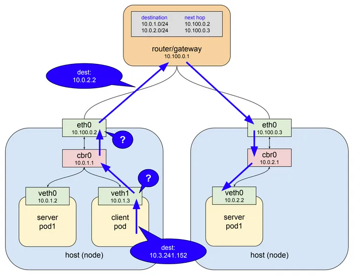
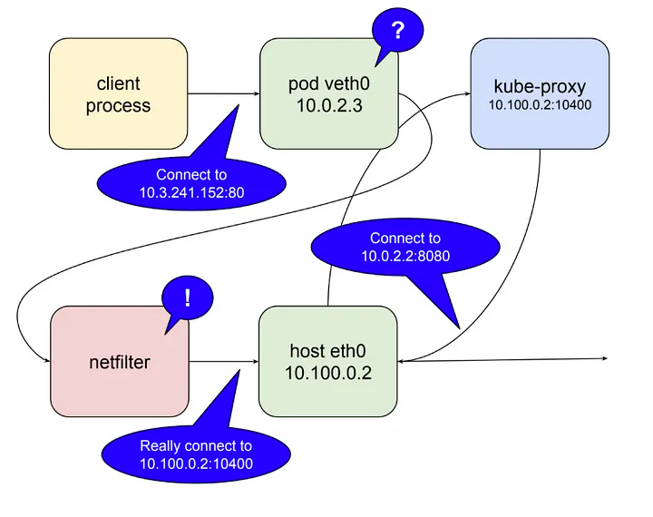
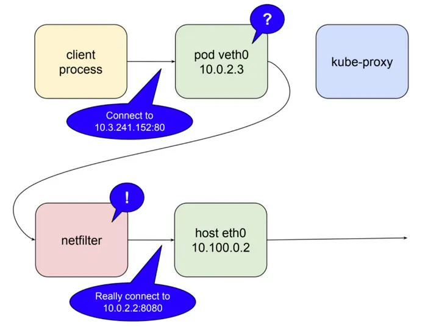

# Pod와 Service 간의 통신

ClusterIP를 생성하면 iptables의 설정 적용
- Kube-proxy 컴포넌트로 서비스 트래픽 제어
- Iptables는 리눅스 커널 기능인 netfilter를 사용하여 트래픽 제어
- Iptables는 7레이어의 2계층부터 7계층까지 커버 가능한 프로그램

---

Service 는 아래 3가지 요구사항을 만족하는 리소스 타입으로  
Pod로 트래픽을 포워딩 해주는 프록시 역할을 한다

- proxy 서버 스스로 내구성이 있어야 하며 장애에 대응할 수 있어야 한다.
- 트래픽을 전달할 서버 리스트를 가지고 있어야 한다.
- 서버 리스트 내 서버들이 정상적인지 확인할 수 있는 방법을 알아야 한다.

Pod 네트워크와 동일하게 Service 네트워크 또한 가상 IP 주소이다  
하지만 Pod 네트워크와는 조금 다르게 동작한다

- Pod 네트워크는 실질적으로 가상 이더넷 네트워크 인터페이스(veth)가 세팅되어져 ifconfig에서 조회할 수 있지만, service 네트워크는 ifconfig로 조회할 수 없다.
- 또한 routing 테이블에서도 service 네트워크에 대한 경로를 찾아볼 수 없다.

---

아래와 같은 Service 네트워크와 파드 구성시

client pod 가 service 네트워크를 통해 service pod1으로 http request 요청 과정 예시

```yaml
apiVersion: v1
kind: Service
metadata:
  name: service-test # service의 이름
spec:
  selector:
    app: server_pod1 # 10.0.1.2와 10.0.2.2에서 돌아가고 있는 서버 컨테이너의 pod 라벨
  ports:
    - protocol: TCP
      port: 80 # service에서 서버 컨테이너 어플리케이션과 매핑시킬 포트 번호
      targetPort: 8080 # 서버 컨테이너에서 구동되고 있는 서버 어플리케이션 포트 번호
```



1. 전체 흐름
- client pod가 http request를 service-test라는 DNS 이름으로 요청한다.
- 클러스터 DNS 서버(coredns)가 해당 이름을 service IP(예시로 10.3.241.152 이라고 한다)로 매핑시켜준다.
- http 클라이언트는 DNS로부터 IP를 이용하여 최종적으로 요청을 보내게 된다.

2. kube-proxy의 패킷 흐름 제어

리눅스 커널 기능 중 하나인 netfilter와 user space에 존재하는 인터페이스인 iptables라는 소프트웨어를 이용하여 패킷 흐름을 제어한다
- netfilter란 Rule-based 패킷 처리 엔진이며, kernel space에 위치하여 모든 오고 가는 패킷의 생명주기를 관찰한다. 그리고 규칙에 매칭되는 패킷을 발견하면 미리 정의된 action을 수행한다.
- iptables는 netfilter를 이용하여 chain rule이라는 규칙을 지정하여 패킷을 포워딩 하도록 네트워크를 설정한다.


https://en.wikipedia.org/wiki/Iptables

쿠버네티스는 이 netfilter를 kernel space에서 proxy(Destination proxy)형태로 사용한다.

kube-proxy가 user space 모드로 동작할 때 과정은 아래와 같다.

- kube-proxy가 localhost 인터페이스에서 service의 요청을 받아내기 위해 10400 포트(임의)를 연다.
- kube-proxy가 netfilter로 하여금 service IP(10.3.241.152:80)로 들어오는 패킷을 kube-proxy 자신에게 라우팅 되도록 설정을 한다.
- kube-proxy로 들어온 요청을 실제 server pod의 IP:Port(예제에서는 10.0.2.2:8080)로 요청을 전달한다.



이러한 방법을 통해 service IP(10.3.241.152:80)로 들어온 요청을 마법처럼 실제 server pod가 위치한 10.0.2.2:8080으로 전달할 수 있다.

---

user space에서 proxying 하는 것은 모든 패킷을 user space에서 kernel space로 변환을 해야 하기 때문에 그만큼 비용이 든다.  
그래서 kubernetes 1.2 버전 이상의 kube-proxy 에서는 이 문제를 해결하기 위해 iptables mode가 생겼다.  
이 모드에서는 kube-proxy가 직접 proxy의 역할을 수행하지 않고 그 역할을 전부 netfilter에게 맡긴다.  
이를 통해 service IP를 발견하고 그것을 실제 Pod로 전달하는 것은 모두 netfilter가 담당하게 되었고  
kube-proxy는 단순히 netfilter의 규칙을 알맞게 수정하는 것을 담당할 뿐이다.  



